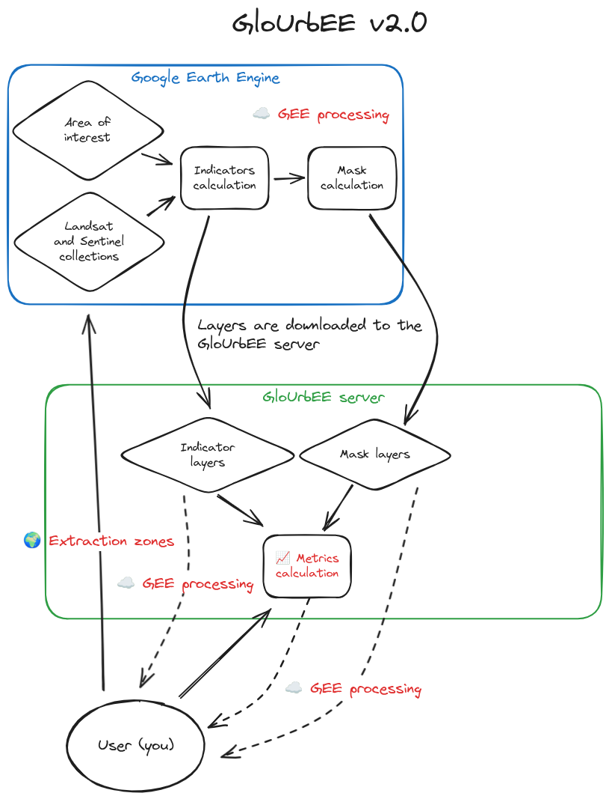

# GloUrbEE - Extract GloUrb metrics and indicators from Google Earth Engine

# Installation

- Windows
```powershell
python -m venv env --prompt glourbee
.\env\Scripts\activate
python -m pip install -U pip
python -m pip install -e .
```

- Linux
```bash
python -m venv env --prompt glourbee
source env/bin/activate
python -m pip install -U pip
python -m pip install -e .
```

# Example usage

The `notebook.ipynb` file contains example of how to use the GloUrbEE tool.

# Start the UI

The GloUrbEE-UI allow you to use the main GloUrbEE package workflow with a fancy user-friendly interface.



## With docker (recommended)

Copy-paste .env.example to .env and make your changes. 

```bash
docker compose up
```

## With streamlit 

- Windows
```powershell
.\env\Scripts\activate
streamlit run ui/app.py
```

- Linux
```bash
source env/bin/activate
streamlit run ui/app.py
```

The application should be available at http://localhost:8501

# Data extracted
## Metrics

The 4 extracted classes are WATER for water polygons, AC for active channel polygons, VEGETATION for vegetation polygons and CLOUDS for clouds.
The indicators calculated are NDVI, NDWI, MNDWI and BSI. 

| metric name | description |   
|---|---|
| ZONE_AREA | Area (number of pixels) of the image in the extraction area |
| *class_name*_AREA | Area (number of pixels) of this class in the extraction area |
| *indicator*_MIN | Minimal value of the indicator in the full extraction area |
| *indicator*_MEAN | Mean value of the indicator in the full extraction area |
| *indicator*_MAX | Maximal value of the indicator in the full extraction area |
| *indicator*_STD | Standard deviation of the indicator in the full extraction area |
| *class_name*\_POLYGONS_indicator_MIN | Minimal value of the indicator in the class polygons inside the extraction area |
| *class_name*\_POLYGONS_*indicator*_MEAN | Mean value of the indicator in the class polygons inside the extraction area |
| *class_name*\_POLYGONS_*indicator*_MAX | Maximal value of the indicator in the class polygons inside the extraction area |
| *class_name*\_POLYGONS_*indicator*_STD | Standard deviation of the indicator in the class polygons inside the extraction area |
| *class_name*\_POLYGONS_COUNT | Number of patches of the class inside the extraction area |
| *class_name*_AREA | Number of pixels of the class in the extraction zone |
| *class_name*\_POLYGONS_AREA_p* | Distribution (percentiles) of the number of pixel of each polygon of the class |
| *class_name*\_POLYGONS_PERIMETER_p* | Distribution (percentiles) of the permieter of each polygon of the class |
| *class_name*\_POLYGONS_ECCENTRICITY_p* | Distribution (percentiles) of the eccentricity<sup>1</sup> of each polygon of the class |
| *class_name*\_POLYGONS_SOLIDITY_p* | Distribution (percentiles) of the solidity<sup>2</sup> of each polygon of the class |

<sup>1</sup> Eccentricity of the ellipse that has the same second-moments as the polygon. The eccentricity is the ratio of the focal distance (distance between focal points) over the major axis length. The value is in the interval [0, 1). When it is 0, the ellipse becomes a circle. [Source...](https://scikit-image.org/docs/stable/api/skimage.measure.html)

<sup>2</sup> Solidity is the ratio of pixels in the polygon to pixels of the convex hull image. [Source...](https://scikit-image.org/docs/stable/api/skimage.measure.html)

### How the masks are extracted
To extract the water, active channel and vegetation masks, the following expressions are proposed as default parameters depending of the selected imagery.
You can define custom ones using the `workflow.startWorflow()` `watermask_expression`, `activechannel_expression` and `vegetation_expression` parameters. The available layers for expressions are:`BLUE`,`GREEN`,`RED`,`NIR`,`SWIR1`,`SWIR2`,`MNDWI`,`NDWI`,`NDVI`.

##### Landsat imagery default masks
```py
watermask_expression = 'MNDWI > 0.0'
activechannel_expression = 'MNDWI > -0.4 && NDVI < 0.2'
vegetation_expression = 'NDVI > 0.15'
```

##### Sentinel-2 imagery default masks
```py
watermask_expression = 'NDWI > -0.1'
activechannel_expression = 'NDWI > -0.4 && NDVI < 0.2'
vegetation_expression = 'NDVI > 0.15'
```

## Indicators
| indicator name | description |   
|---|---|
| occurrence_p* | The frequency with which water was present (JRC Global Surface Water Mapping) |
| change_abs_p* | Absolute change in occurrence between two epochs: 1984-1999 vs 2000-2021 (JRC Global Surface Water Mapping) |
| change_norm_p* | Normalized change in occurrence. (epoch1-epoch2)/(epoch1+epoch2) * 100 (JRC Global Surface Water Mapping) |
| seasonality_p* | Number of months water is present (JRC Global Surface Water Mapping) |
| recurrence_p* | The frequency with which water returns from year to year (JRC Global Surface Water Mapping) |
| max_extent | Surface where water has ever been detected (JRC Global Surface Water Mapping) |

# Credits
Many thanks to:
- [Barbara Belletti](https://github.com/bbelletti) for the original concept and ideas
- Khalid for the first Python version
- [Louis Rey](https://github.com/LouisRey74) for huge testing
- [Julie Limonet](https://github.com/Julielmnt) for the UI skeleton
- [Leo Helling](https://github.com/jlhelling) for the Sentinel-2 integration
- [Samuel Dunesme](https://github.com/sdunesme)

# Citation 
[](https://zenodo.org/doi/10.5281/zenodo.11235572)

Dunesme, S., Belletti, B., Helling, L., & Limonet, J. (2024). EVS-GIS/glourbee. UMR5600 Environnement, Ville, Société. https://doi.org/10.5281/zenodo.11235572
